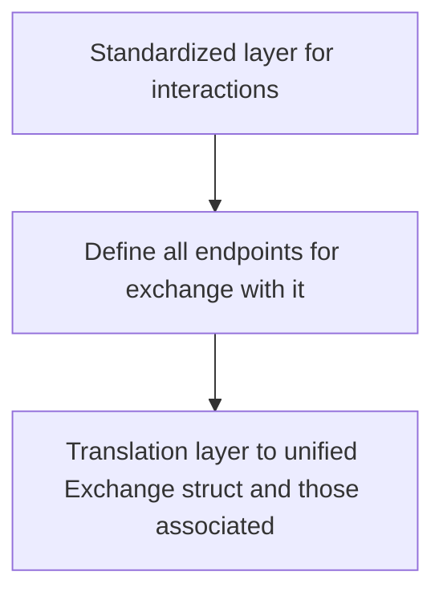

<!--follows https://matklad.github.io/2021/02/06/ARCHITECTURE.md.html-->
# Architecture

### `generic-api-client`
Provides a standardized interface for defining how an exchange wants to be communicated with.

### `v_exchanges_core`
Defines `Exchange` trait and associated structs. If some interactions/methods can be generalized _on top of_ the specified standard objects, they can also be exposed here (under a feature flag probably).

### `v_exchanges`
Implementation of each exchange's interactions, consists of blocks for

- `Settings` struct that persists keys, session tokens, etc
- enum with all API endpoints
- `binance-rs`-like function call for all the ones I care about. They return predefined Response structs
- impl of `Exchange` trait
	so say `binance` would have a `struct Binance(BinanceSettings)`, where all the `Exchange` functions first call native method on `BinanceSettings`, then just apply translation
