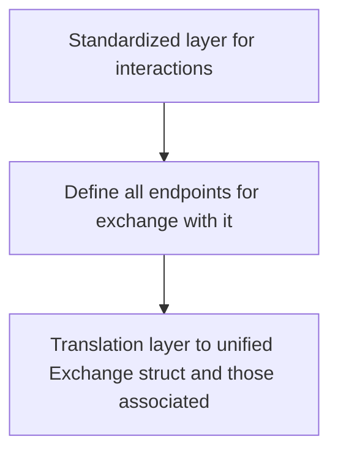

<!--follows https://matklad.github.io/2021/02/06/ARCHITECTURE.md.html-->
# Architecture


### `v_exchanges_api_generics`
Provides a standardized interface for defining how an exchange wants to be communicated with.

### `v_exchanges`

#### `::core`
Defines `Exchange` trait and associated structs. If some interactions/methods can be generalized _on top of_ the specified standard objects, they can also be exposed here (under a feature flag probably).

#### other
Split into sections for each implemented exchange.
In each we make the calls and deserialize the responses from the endpoints we care about, following `Exchange` trait specialization. They are then immediately translated into a general form, which is the same across all exchanges (even if at the cost of some data).

Some functions on specific exchange+endpoint pairs, on `Exchange` trait or not, could build upon other calls (eg stitching together a longer `/aggrTrade` response than what's allowed). When doing so, we still use general forms of return from each established endpoint interaction.

### data endpoints
Some exchanges provide specialized `data` endpoints. Those can't be part of `Exchange` trait, but then I just trivially expose them natively on the associated structs of each exchange, without any traits whatsoever. 

# Target Interaction
Two mods:
a) arbitrary exchange, determined at runtime
```rs
let mut args_iter = std::env::args().skip(1);
let ticker: Ticker = match Ticker::from_str("binance:BTC-USDT.P").unwrap();
let client = ticker.exchange_name.init_client();
let klines: Klines = client.klines(ticker.symbol, "1m".into(), 2.into()).await.unwrap();
println!("{klines}");
```
b) want to work with specific exchange, known at comp time
```rs
use v_exchanges::Exchange as _;
let mut binance = ExchangeName::Binance.init_client();
let symbol = Symbol::from_str("BTC-USDT.P").unwrap();
let price = binance.price(symbol).await.unwrap();
println!("{price}");
```
Both should be equally seamless to work with (not the case as of (2025/04/01))
