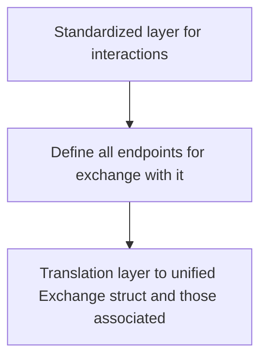

# Architecture

```mermaid
flowchart TD
	S["Standardized layer for interactions"]
	D["Define all endpoints for exchange with it "]
	T["Translation layer to unified Exchange struct and those associated"]

	S --> D
	D --> T
```

TODO: https://matklad.github.io/2021/02/06/ARCHITECTURE.md.html
